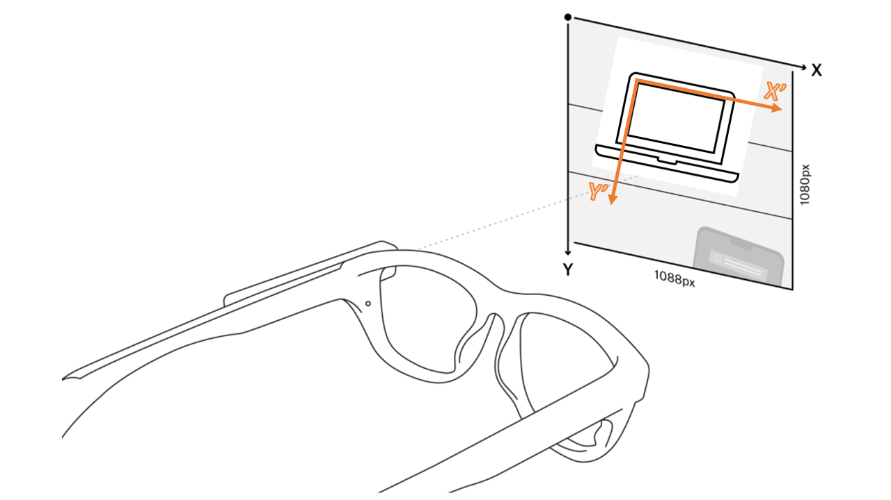

# Gaze Mouse
## Introduction
This project aims to get mouse control using the coordinates given by eye-tracking glasses. We used the "Invisible" glasses created by Pupil Labs. This GitHub is the result of the project of the "Virtual Processing and Smart Spaces" course, in 2021.

This project was produced by : 
 - Julien Bertieaux (Julien.BERTIEAUX@student.umons.ac.be)
 - Cyrille Finet (Cyrille.FINET@student.umons.ac.be)
 - Charles Moulin (Charles.MOULIN@student.umons.ac.be)
 - Robin Vandebrouck (Robin.VANDEBROUCK@student.umons.ac.be)
 - Benoît Vidotto (Benoit.VIDOTTO@student.umons.ac.be)

This project was realised at the University of Umons (https://web.umons.ac.be/en/) at the Faculty of engineering (https://web.umons.ac.be/fpms/en/) in the ISIA departement (https://web.umons.ac.be/numediart/en/about/)

## Implementation summary 

The objective is to transform data given by the glasses and use it to control a mouse. This goal is achieved through several steps. First, we started using the [repository](https://github.com/pupil-labs/pupil-invisible-monitor) given by Pupil Labs. The pipeline allowed us to extract the gaze coordinates and the video stream. Unfortunately, the coordinates are not directly usable. Indeed, we need to convert the coordinates from the glasses to the computer point of view. The glasses give coordinates within 1088x1080 matrix. We need to adapt the gaze coordinates to a standard 1920x1080 screen. The conversion is illustrated on the following figure :

  

In order to convert, we used the ARuco [repository](https://github.com/KhairulIzwan/ArUco-markers-with-OpenCV-and-Python) to recognize markers. The markers are placed on the computer screen. Those markers allow us to scale the gaze coordinates.

Then, used the Vosk speech recognition algorithm to execute voice commands such as : left-click, right-click or scroll.
